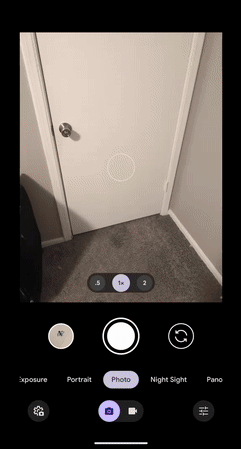

# 💼 Evan Markle - Augmented Reality Business Card

This project is a mobile-friendly augmented reality business card built with [A-Frame](https://aframe.io/) and [MindAR](https://hiukim.github.io/mind-ar-js-doc/). When users point their phone camera at a printed target (a qr code), interactive 3D buttons appear, linking to my professional profiles and contact info.

## 📱 Features

- Mobile-first AR experience powered by MindAR
- Tap-based raycasting to open links on mobile
- Fully responsive UI with a startup modal for instructions
- Polished UI and animations for interactive 3D models

## 🚀 Getting Started

1. Open the page on your mobile device.
2. Tap "Start" in the modal popup.
3. Allow camera access.
4. Point the camera at the printed AR marker.
5. Tap 3D icons to open GitHub, LinkedIn, Instagram, or send an email.

## 💡 Future Improvements

- Improve animations
- Easter eggs
- Include accessibility options for non-AR users
- Support multiple image targets and layered info
- Offline fallback for desktop users

## 📄 License

This project is open source
